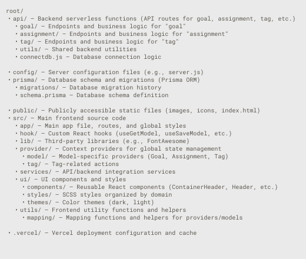

# Reach Goals - A Web App to Help You Manage Your Personal Tasks

> 🚧 This project is under active development. More features and improvements are coming soon. A demo mode will be available soon.

**Reach Goals** is a modern web application designed to help you manage your daily activities, such as assignments and personal goals.

## 🪄 Features

**Activities:** Create and organize your activities for any day you choose.

**Categories:** Group your activities using tags and categories, and combine different types of tasks.

**View Modes:** Visualize your activities in different formats, such as a **calendar** or **list** view.

**Detail View:** Navigate into any assignment or goal to access a detailed display, providing a focused view of your activity’s content.

## 📁 Project structure
