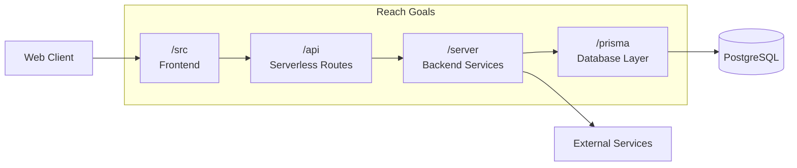

# Reach Goals - A Web App to Help You Manage Your Personal Tasks
🌐 [Try the Demo](https://reach-goals.vercel.app)


## 📖 About

**Reach Goals** is a modern web application designed to help you manage your daily activities, such as assignments and personal goals.

The project was created with two main purposes:

Provide a practical productivity tool for managing goals and assignments.
Share the technical knowledge and development decisions behind the project with other developers.

The source code is publicly available under the MIT License, allowing anyone to study, modify, and build upon the project.

## 🪄 Features

**Demo Session:** Use application with your personal e-mail to start a session.

**Activities:** Create and organize your goals and assignments for any day you choose.

**Categories:** Group your activities using tags to create categories, and combine different types of activities.

**View Modes:** Visualize your activities in different formats, such as a **calendar** or **list** view.

**Detail View:** Navigate into any assignment or goal to access a detailed display, providing a focused view of your activity’s content.

## 📷 Screenshots

### Home


### Calendar


### Objectives


## 📐 Architecture

The application follows a monolithic structure, where the frontend and
backend resources are maintained within the same project.


```mermaid
flowchart LR
    Client[Web Client]

    subgraph App["Reach Goals"]
        Frontend["/src<br/>Frontend"]
        API["/api<br/>Serverless Routes"]
        Server["/server<br/>Backend Services"]
        Prisma["/prisma<br/>Database Layer"]
    end

    DB[(PostgreSQL)]
    External["External Services"]

    Client --> Frontend
    Frontend --> API
    API --> Server
    Server --> Prisma
    Prisma --> DB
    Server --> External
```

**/src**

Contains the frontend resources of the application, including components,
providers, hooks, styles, assets, utilities, and frontend services.

Frontend services are responsible for communicating with the backend through
HTTP requests.

**/api**

Contains the serverless route handlers used by Vercel.

Each handler acts as an entry point for a backend route and determines which
backend service should be executed according to the incoming request.

**/server**

Contains the application's backend services and supporting resources.

Services are responsible for application operations such as CRUD operations,
business logic, authentication, and communication with external services.

**/prisma**

Contains the Prisma resources responsible for the application's data layer,
including the Prisma schema and database migrations.

Prisma is used by backend services to communicate with the PostgreSQL database.

## 🚀 Getting Started

### Requirements

Before running the application, make sure you have:

- Node.js 20 or later
- npm 10 or later
- Git
- A PostgreSQL database
- A Brevo account and API key for email verification

> The project uses Vercel Functions for server-side execution when deployed to
> Vercel. The frontend runs locally through Vite, while the routes in `api/`
> are intended to run as serverless functions on Vercel.

### Installation

Clone the repository from GitHub and enter the application directory:

```bash
git clone https://github.com/LukasO20/reach-goals.git
cd reach-goals/reach-goals-app
```

Install the dependencies:

```bash
npm install
```

### Environment Variables

Create a `.env` file based on the provided example.

Linux/macOS:

```bash
cp .env.example .env
```

Windows PowerShell:

```powershell
Copy-Item .env.example .env
```

Configure the required environment variables:

```env
REACHGOALS_URL="Your pooled PostgreSQL connection URL"
REACHGOALS_URL_NON_POOLING="Your direct PostgreSQL connection URL"
BREVO_API_KEY="Your Brevo API key"
JWT_SECRET="A strong random secret used to sign sessions"
```

| Variable | Purpose |
| --- | --- |
| `REACHGOALS_URL` | Pooled PostgreSQL connection used by the application |
| `REACHGOALS_URL_NON_POOLING` | Direct PostgreSQL connection used by Prisma migrations |
| `BREVO_API_KEY` | Sends email verification codes through Brevo |
| `JWT_SECRET` | Signs authenticated sessions |

`JWT_SECRET` should be a strong, randomly generated value. The PostgreSQL
connection URLs can be obtained from your database provider or Vercel
integration.

**Never commit sensitive credentials or environment variables to the repository.**

### Database

Make sure the PostgreSQL database is available, then generate the Prisma
Client and apply the development migrations:

```bash
npx prisma generate
npx prisma migrate dev
```

For a deployment or other environment where migrations must be applied without
creating new ones, use:

```bash
npx prisma migrate deploy
```

To inspect the database locally, you can use Prisma Studio:

```bash
npx prisma studio
```

### Authentication

The application authenticates users with a verification code sent by email
through Brevo. A valid `BREVO_API_KEY` and an accessible email address are
required to test this flow locally.

### Running the Application

Start the development server:

```bash
npm run start
```

The application uses port `3000` and should be available at:

```text
http://localhost:3000
```

### Available Scripts

| Command | Description |
| --- | --- |
| `npm run start` | Starts the Vite development server |
| `npm run build` | Generates the Prisma Client and creates a production build |
| `npm run serve` | Serves the generated production build locally |

### Deployment

The project is structured for deployment on Vercel. Configure these
environment variables in the Vercel project:

- `REACHGOALS_URL`
- `REACHGOALS_URL_NON_POOLING`
- `BREVO_API_KEY`
- `JWT_SECRET`

Apply the production database migrations with:

```bash
npx prisma migrate deploy
```

### Troubleshooting

- **Database connection errors:** check `REACHGOALS_URL` and
  `REACHGOALS_URL_NON_POOLING`.
- **Email verification errors:** check `BREVO_API_KEY` and make sure the
  recipient email address is accessible.
- **Session or JWT errors:** check `JWT_SECRET`.
- **Missing or outdated Prisma Client:** run `npx prisma generate`.
- **Missing database tables:** run `npx prisma migrate dev`.
- **Port 3000 already in use:** stop the process using the port or change
  `server.port` in `vite.config.js`.
